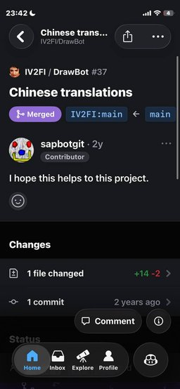

## Hi there 👋

I write on Lua and JavaScript.

🔭 I’m currently working on [Retro Romarchive](http://cows.info.gf:90)

## My pull requests

In total, I made **5** pull requests on **4** projects.

| Preview                                                                 | Repository                                   | Title                                       | Date |
|-------------------------------------------------------------------------|----------------------------------------------|---------------------------------------------| --------- |
|   | [IV2FI/DrawBot](https://github.com/IV2FI/DrawBot) | Translation to Russian                    | Mar 2, 2024 |
|  | [IV2FI/DrawBot](https://github.com/IV2FI/DrawBot) | Chinese translations | Mar 4, 2024 |
|   | [gd4Ark/star-battle](https://github.com/gd4Ark/star-battle) | Russian README         | Mar 26, 2024 |
|  | [DJSures/NABU-LIB](https://github.com/DJSures/NABU-LIB) | Fix a typos | Apr 27, 2025 |
|  | [hackclub/sprig](https://github.com/hackclub/sprig) | Trash Out+ | Apr 29, 2025 |
|  | [hackclub/sprig](https://github.com/hackclub/sprig) | Yet Another Sprig 3D Engine | Jun 3, 2025 |
